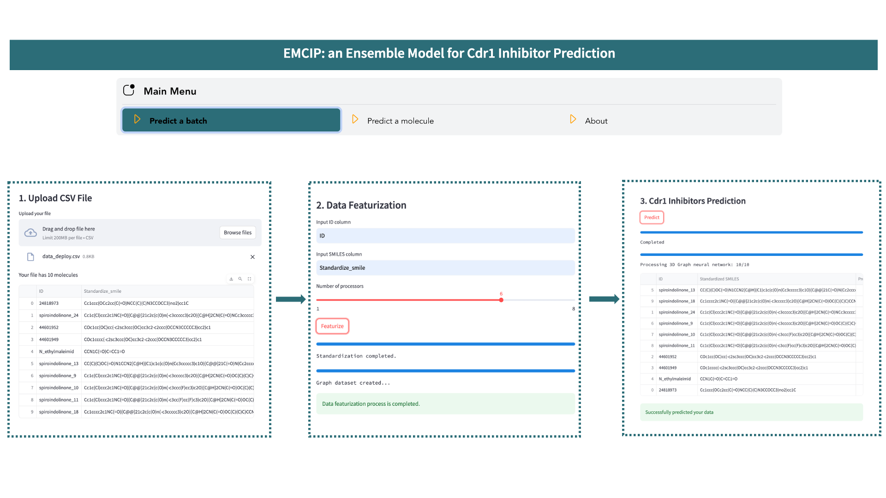
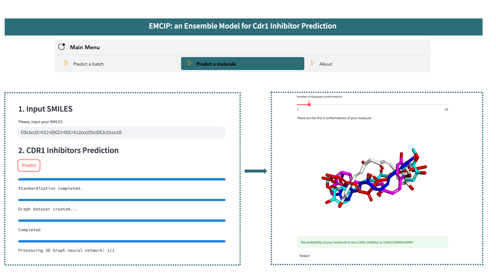

# EMCIP: An Ensemble Model for Cdr1 Inhibitor Prediction


We introduce the **EMCIP model** for classifying potential Cdr1 inhibitors.

## Table of Contents

- [Installation](#installation)
- [EMCIP GUI](#emcip-gui)
  - [Batch Prediction](#batch-prediction)
  - [Molecule Prediction](#molecule-prediction)
  - [HuggingFace Version](#huggingface-version)
- [Additional Information](#additional-information)
  - [Datasets](#datasets)
  - [Molecular Representation Analysis](#molecular-representation-analysis)
  - [Traditional Machine Learning Model Selection](#traditional-machine-learning-model-selection)
  - [MIL-3D-GNN](#mil-3d-gnn)
- [Contributors](#contributors)
- [Contact](#contact)
- [Acknowledgments](#acknowledgments)

## Installation

To set up the environment for EMCIP, you'll need Conda v24.1.2 and Pip 23.3.1. For Conda installation instructions, refer to [this link](https://conda.io/projects/conda/en/latest/user-guide/install/index.html).

Run the following commands in your terminal to install EMCIP:

```bash
git clone https://github.com/trinhthechuong/Cdr1_inhibitors.git
cd Cdr1_inhibitors
conda env create --file environment.yml
conda activate EMCIP_env
pip install -r requirements.txt
streamlit run EMCIP.py
```

## EMCIP GUI

EMCIP provides two functionalities: Batch Prediction and Molecule Prediction.

### Batch Prediction

In the main menu, select the `Predict a batch` option and follow these steps:

1. Upload a **.csv* file. The file must contain two columns: the first for molecule names or IDs, and the second for the SMILES of these molecules. Then, provide names for your columns and choose the number of processors for the calculation.
2. Click the `Featurize` button and wait for the process to complete. During this step, your molecules will be standardized and converted into various molecular representations (RDK5, RDK6, RDK7, Avalon, Mordred, Gobbi Pharmacophore) and 3D molecular graphs.
3. Once featurization is complete, click the `Prediction` button to predict your data.

All featurized datasets and prediction results are saved in the `Cdr1_classification` folder. Click the `Restart` button to start predicting another file.



### Molecule Prediction

In the main menu, select the `Predict a molecule` option and follow these steps:

1. Enter the SMILES string of your molecule.
2. Click the `Predict` button and wait for the completion of the process. During this step, your molecule are standardized, converted into various molecular representations (RDK5, RDK6, RDK7, Avalon, Mordred, Gobbi Pharmacophore) and 3D molecular graphs, before being evaluated by the EMCIP model for prediction.
3. The output is the predicted probability of your molecule being a Cdr1 inhibitor.
Additionally, you can interact with the generated conformations used as input for MIL-3D-GNN.


### HuggingFace Version
The EMCIP model is also available for direct prediction on the HuggingFace platform [EMCIP-HuggingFace](https://huggingface.co/spaces/thechuongtrinh/EMCIP_Cdr1_inhibitor_prediction). However, for optimal performance, we recommend installing EMCIP locally to leverage the power of your local processors.

## Additional Information
The `dataset` folder stores all training data and corresponding results.
### Datasets
- **original_dataset.csv**: This file contains all assembled molecules for EMCIP along with their references.
- `Featurized_data` folder:
    - `BM_stratified_sampling`: This sub-folder stores all datasets used for training (training set), validation (external test set, and hard test set).
    - `MIL_3D_GNN`: This sub-folder stores graph datasets specifically used for the MIL-3D-GNN model.
### Molecular Representation Meta-Analysis
- `molecular_representation_analysis` sub-folder contains all 16 ligand-based structural representation datasets and the results of the associated meta-analysis, including Wilcoxon signed-rank test.
### Traditional Machine Learning Model Selection
- `ml_model_selection` sub-folder stores all validation results, including Bemis-Murcko Scaffold 5-fold cross-validation and external test set validation of traditional machine learning models. 
- `bayesian_estimation` sub-folder houses the results comparing machine learning model performance through Bayesian estimation
### MIL-3D-GNN
- Validation results for MIL-3D-GNN on validation, external, and hard test sets are stored in the `validation_mil_3d_gnn` subfolder. 
- To view the hyperparameter tuning process for MIL-3D-GNN, run the following commands in your terminal:  
```bash
cd MIL_3D_GNN
mlflow server --host 127.0.0.1 --port 8080
```
- [**graph_featurization.ipynb**](./MIL_3D_GNN/graph_featurization.ipynb): This Jupyter Notebook details the process of converting molecules into graph representations for use with the MIL-3D-GNN model.
## Contributors

1. [The-Chuong Trinh](https://trinhthechuong.github.io/)
2. [Viet-Khoa Tran-Nguyen](https://www.researchgate.net/profile/Viet-Khoa-Tran-Nguyen)
3. [Pierre Falson](https://www.researchgate.net/profile/Pierre-Falson)
4. [Achène Boumendjel](https://www.researchgate.net/profile/Ahcene-Boumendjel)

## Contact

For further queries, please contact:
- The-Chuong Trinh: [the-chuong.trinh@etu.univ-grenoble-alpes.fr](mailto:the-chuong.trinh@etu.univ-grenoble-alpes.fr), [thechuong123@gmail.com](mailto:thechuong123@gmail.com)
- Viet-Khoa Tran-Nguyen: [viet-khoa.tran-nguyen@u-paris.fr](mailto:viet-khoa.tran-nguyen@u-paris.fr), [khoatnv1993@gmail.com](mailto:khoatnv1993@gmail.com)
- Achène Boumendjel: [ahcene.boumendjel@univ-grenoble-alpes.fr](mailto:ahcene.boumendjel@univ-grenoble-alpes.fr)

## Acknowledgments
We extend our gratitude to all contributors and the community for their invaluable support. We offer special thanks to the Laboratoire Radiopharmaceutiques Biocliniques, INSERM U1039, Université Grenoble Alpes, 38000 Grenoble, France. We also acknowledge RDKit, DeepChem, and PyTorch Geometric for their essential tools and resources. Additionally, we thank the CBH Graduate School - Université Grenoble Alpes for awarding the CBH Graduate School scholarship.