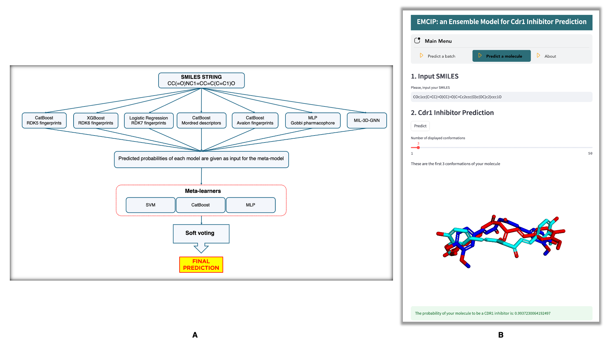

# EMCIP: AN ENSEMBLE MODEL FOR CDR1 INHIBITOR PREDICTION
=== 

We herein introduce the **EMCIP model** for classifying pontential Cdr1 inhibitors.
## Installation
===
The Conda is needed to set up the environment for EMCIP. Installation instructions for Conda can be found at [https://conda.io/projects/conda/en/latest/user-guide/install/index.html](https://conda.io/projects/conda/en/latest/user-guide/install/index.html).
Write these code to your terminal to install EMCIP
```bash
git clone https://github.com/trinhthechuong/Cdr1_inhibitors.git
cd Cdr1_inhibitors
conda env create --file environment.yml
conda activate EMCIP_env
pip install -r requirements.txt
streamlit run EMCIP.py
```
## EMCIP GUI
===
We offer you two ways for using the EMCIP for non-expert users: Batch prediction and Molecule prediction
### Batch prediction
In the main menu, click `Predict a batch` tab. Follow these steps:
1. Upload your *.csv file. Your *.csv file must have two columns. The first column contains the name or ID of your molecules, the second column contains the SMILES of these molecules. Then input the name of your first column, second column, and choose the number of processors for the calculation process.
2. Click `Featurize` button and wait for a while. Your molecules will be standardized, calculated to molecular representations (RDK5, RDK6, RDK7, Avalon, Mordred, Gobbi Pharmacophore) and 3D molecular graphs.
3. After the featurize process is completed, click `Prediction` button to predict your data.
* All the featurized dataset, and  prediction result are saved in `Cdr1_classification` folder. Click `Restart` button to start predicting another file.

### Molecule prediction
In the main menu, click `Predict a molecule` tab. Follow these steps:
1. Input the SMILE of your molecule. 
2. Click `Predict` button and wait for a while. Your molecule will be standardized, calculated to molecular representations (RDK5, RDK6, RDK7, Avalon, Mordred, Gobbi Pharmacophore) and 3D molecular graphs, and predicted by EMCIP model.
3. The output is the predicted probability of your molecule to be Cdr1 inhibitor. 
*You can see and interact with generated conformations used as the input for MIL-3D-GNN.*  

## Other informations
===
All the datasets and results of our training procedure are stored in the `dataset`folder.
### Datasets
- `original_dataset.csv` contains all the assembled molecules to conduct EMCIP and their references. 
- All datasets (training set, external test set, hard test set) are stored in `Featurized_data/BM_stratified_sampling` subfolders.
- Graph datasets for MIL-3D-GNN are stored in `Featurized_data/MIL_3D_GNN` subfolders.
### Molecular representation analysis
- All 16 ligand-based structural representation datasets, and the results of molecular representation meta-analysis in `molecular_representation_analysis` subfolder.
### Traditional Machine learning model selection
-  All the validation results, including Bemis-Murcko Scaffold 5-fold cross-validation and external test set validation, are stored in `ml_model_selection` subfolder.
-  The Bayesian estimation results to compare ML model performance are stored in `ml_model_selection/bayesian_estimation` subfolder.
### MIL-3D-GNN 
- The validation results of MIL-3D-GNN on validation set, external test set, and hard test set are stored in `validation_mil_3d_gnn` subfolder.
- To display our hyperparameter tuning for MIL-3D-GNN, input these codes in your terminal:
```bash
cd <"Cdr1_inhibitors path">
mlflow server --host 127.0.0.1 --port 8080
```
- To visit our multi-instance learning framwork for 3GNN, please access these 2 notebooks:[Graph featurization](./Cdr1_inhibitors/MIL_3D_GNN/graph_featurization.ipynb) and [GNN prediction](./Cdr1_inhibitors/MIL_3D_GNN/investigate_tuned_gnn.ipynb)


